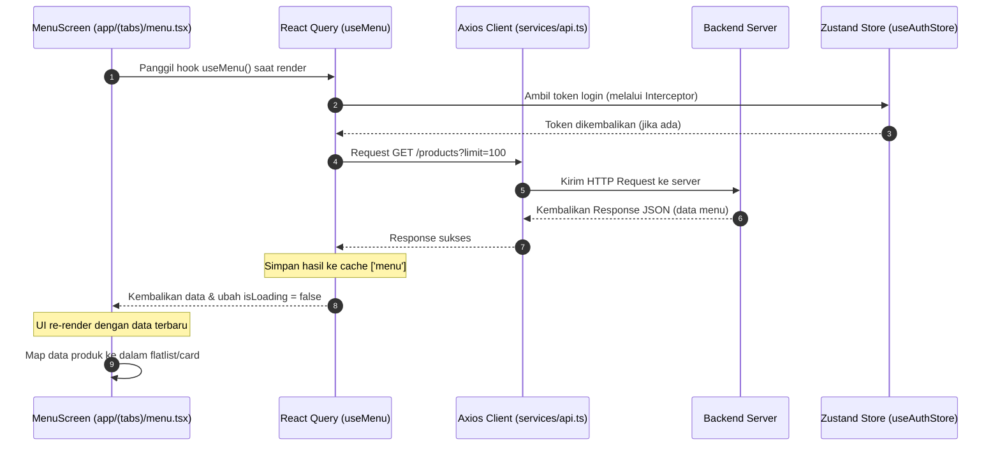
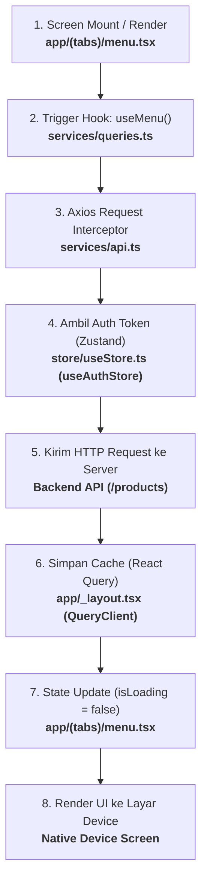

# Arsitektur Aplikasi Mobile - Toko Kopi Jaya 👋

Dokumen ini menjelaskan struktur folder, pengelolaan antarmuka (UI), penanganan HTTP request (API), manajemen state (Zustand & React Query), serta alur kerja data dari API hingga ditampilkan pada perangkat.

---

## 📂 Struktur Direktori Utama

Berikut adalah bagian penting dari direktori `mobile/` yang mengatur logika, state, dan tampilan:

*   **`app/`**: Folder utama navigasi berbasis file (**Expo Router**).
    *   [_layout.tsx](file:///Users/aagungwwahyu/Documents/Project/toko-kopi-jaya/mobile/app/_layout.tsx): Gerbang utama aplikasi (mengatur AuthGate, push notifications, dan provider global).
    *   `(tabs)/`: Layar navigasi utama di bagian bawah (*bottom tabs*):
        *   [index.tsx](file:///Users/aagungwwahyu/Documents/Project/toko-kopi-jaya/mobile/app/(tabs)/index.tsx): Halaman Home.
        *   [menu.tsx](file:///Users/aagungwwahyu/Documents/Project/toko-kopi-jaya/mobile/app/(tabs)/menu.tsx): Halaman Menu produk kopi dan kategori.
        *   [orders.tsx](file:///Users/aagungwwahyu/Documents/Project/toko-kopi-jaya/mobile/app/(tabs)/orders.tsx): Halaman daftar pesanan aktif dan riwayat.
        *   [profile.tsx](file:///Users/aagungwwahyu/Documents/Project/toko-kopi-jaya/mobile/app/(tabs)/profile.tsx): Halaman profil pengguna.
    *   `product/` & `detail/`: Halaman detail item produk.
    *   `checkout/` & `cart.tsx`: Layar pemrosesan transaksi belanja.
*   **`services/`**: Menangani koneksi ke API server.
    *   [api.ts](file:///Users/aagungwwahyu/Documents/Project/toko-kopi-jaya/mobile/services/api.ts): Konfigurasi dasar Axios client & request interceptor.
    *   [queries.ts](file:///Users/aagungwwahyu/Documents/Project/toko-kopi-jaya/mobile/services/queries.ts): Custom hooks untuk React Query (`useQuery` & `useMutation`).
*   **`store/`**: Global state management client menggunakan **Zustand**.
    *   [useStore.ts](file:///Users/aagungwwahyu/Documents/Project/toko-kopi-jaya/mobile/store/useStore.ts): Mengelola auth token, data profile user, dan item keranjang belanja.
    *   [useOrderStore.ts](file:///Users/aagungwwahyu/Documents/Project/toko-kopi-jaya/mobile/store/useOrderStore.ts): Mengelola data transaksi saat checkout (lokasi pengiriman, voucher, kurir, tipe order).

---

## 🔄 Alur Integrasi UI ➔ State ➔ API

Aplikasi ini memisahkan state menjadi dua kategori utama:
1.  **Server State** (Data dinamis dari server): Dikelola oleh **React Query** (`@tanstack/react-query`) untuk caching, loading state, dan auto-refetching.
2.  **Client State** (Data lokal global): Dikelola oleh **Zustand** untuk menyimpan session token, data keranjang, dan konfigurasi checkout aktif.

### Diagram Alur Data (Contoh: Menampilkan Menu Produk)



### Flowchart Jalur File

Berikut adalah flowchart yang menunjukkan alur eksekusi data beserta file-file terkait:



### 1. Inisialisasi HTTP Client & Interceptor
Request ke backend menggunakan instance **Axios** yang dikonfigurasi di [api.ts](file:///Users/aagungwwahyu/Documents/Project/toko-kopi-jaya/mobile/services/api.ts):
```typescript
const api = axios.create({
  baseURL: API_URL,
  timeout: 10000,
});

api.interceptors.request.use(async (config) => {
  const token = useAuthStore.getState().token;
  if (token) {
    config.headers.Authorization = `Bearer ${token}`;
  }
  return config;
});
```
*Setiap kali aplikasi mengirim request, interceptor akan secara otomatis menyisipkan token JWT user aktif dari Zustand store.*

### 2. Custom Hooks React Query
Di dalam [queries.ts](file:///Users/aagungwwahyu/Documents/Project/toko-kopi-jaya/mobile/services/queries.ts), request Axios dibungkus menggunakan React Query untuk mengelola lifecycle data:
```typescript
export const useMenu = () => {
  return useQuery({
    queryKey: ['menu'],
    queryFn: async () => {
      const { data } = await api.get('/products?limit=100');
      return data.data;
    },
  });
};
```

### 3. Rendering pada UI Layar Device
Di dalam file UI seperti [menu.tsx](file:///Users/aagungwwahyu/Documents/Project/toko-kopi-jaya/mobile/app/(tabs)/menu.tsx), hook dipanggil untuk mendapatkan status loading, error, dan data:
```typescript
const { data: products, isLoading } = useMenu();

if (isLoading) {
  return <ActivityIndicator size="large" color={Colors.primary} />;
}

return (
  <FlatList
    data={products}
    renderItem={({ item }) => <ProductCard product={item} />}
    keyExtractor={(item) => item.id.toString()}
  />
);
```

---

## ⚡ Ringkasan Teknologi & Fitur
*   **Framework**: Expo SDK (React Native)
*   **Routing**: Expo Router (File-based navigation)
*   **HTTP Client**: Axios dengan Token Interceptors
*   **Server Cache**: React Query (`@tanstack/react-query`) untuk optimasi performa request
*   **Global Client State**: Zustand (dengan persistence ke `AsyncStorage` & `SecureStore`)
*   **Icons & Assets**: `@expo/vector-icons` (Ionicons)
